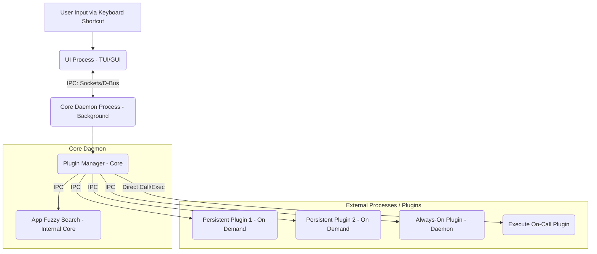

# TarraGon

A Wayland-friendly, highly extensible application launcher designed for speed and responsiveness, featuring a powerful plugin architecture.

---

## Core Purpose

- **Primary**: Fast, fuzzy-matching application launcher integrating results from multiple sources (applications, plugins).
- **Secondary**: Extensible via external plugins for calculations, web search, clipboard management, unit conversion, and more. Prefixes (e.g., `@search`) can be used to explicitly target plugins but are not required for general suggestions.

---

## Core Architecture

- **Daemon Mode**: The core launcher logic runs as a persistent background daemon for instant availability.
- **Attachable UI**: A lightweight UI (TUI or GUI) attaches to the daemon via a keyboard shortcut, providing immediate access. Communication between UI and daemon uses efficient IPC (e.g., Unix sockets, D-Bus).

---

## Features

### Application Launcher
- Parses `.desktop` files to find and launch installed applications.
- Fuzzy search with user-configurable scoring.
- Frecency-based sorting (frequency × recency).
- Optional icon display (depending on UI backend).

### Plugin System
- **Integrated Suggestions**: Seamlessly blends suggestions from installed applications and active plugins based on user input.
- **Language Agnostic**: Plugins are external executables or scripts.
- **Persistent Processes & IPC**: For responsiveness, plugins providing real-time suggestions typically run as persistent processes managed by the launcher daemon, communicating via efficient IPC (e.g., stdin/stdout, sockets). This avoids per-keystroke startup lag.
- **Plugin Lifecycle Modes**: Plugins declare their required lifecycle:
    - `daemon`: Runs persistently alongside the launcher daemon (e.g., clipboard manager).
    - `on_demand_persistent`: Started when the UI attaches or first needed; remains active while UI is shown (e.g., calculator, file search).
    - `on_call`: Executed only when explicitly invoked, typically via a prefix (e.g., web search).
- **Fan-Out/Gather for Suggestions**: Input is broadcast to the app searcher and all relevant running plugins concurrently. Results are gathered asynchronously and displayed.
- **Optional Prefixes**: Prefixes (e.g., `@search`) remain available to *force* querying a specific plugin.

### Plugin Installation & Security
- **Location**: Plugins reside in `~/.config/tarragon/plugins/`.
- **Build Standard**: Plugins requiring compilation must include a `Makefile` providing standardized targets:
    - `make check-deps`: Verifies necessary build tools are present. The launcher can use this to inform the user about requirements.
    - `make install`: Builds the plugin and places artifacts correctly.
- **User Responsibility**: Users should inspect the `Makefile` of third-party plugins before installation to understand the build process. The launcher may facilitate checking dependencies but relies on the user to vet plugin sources.

---

## Plugin Configuration

Each plugin should have a `.toml` configuration file (e.g., `calc.toml`):

```toml
name = "Calculator"
description = "Evaluate basic math expressions"
enabled = true
entrypoint = "calc_plugin_executable"  # Path to the executable/script relative to plugin dir
lifecycle_mode = "on_demand_persistent"  # Options: "daemon", "on_demand_persistent", "on_call"
provides_general_suggestions = true  # Responds to input without a prefix?
prefix = "@calc"  # Optional: Prefix to force this plugin
build_dependencies = ["make", "go"]  # Optional: List of tools checked by 'make check-deps'
capabilities = ["suggest", "icon"]  # Optional: Extra features
icon = "calc.png"  # Optional: Icon path
```

## Development TODO (Backend/Core - Excluding UI)

### Core Daemon & Architecture

    [ ] Implement basic daemon structure (background process management).
    [ ] Set up IPC mechanism for communication between daemon and potential UI frontend (e.g., Unix Domain Socket or D-Bus).
    [ ] Implement the core input processing loop within the daemon.
    [ ] Design and implement configuration loading (launcher settings, etc.).
    [ ] Implement frecency calculation and storage logic.

### Application Launcher Features

    [ ] Implement .desktop file discovery and parsing.
    [ ] Implement fuzzy search algorithm for application matching.
    [ ] Integrate application search results into the main suggestion list.

### Plugin System - Core Functionality

    [ ] Implement Plugin Manager within the daemon to oversee plugins.
    [ ] Implement plugin discovery mechanism (scanning plugin directory).
    [ ] Implement parsing for plugin configuration (.toml) files.
    [ ] Implement plugin lifecycle management (handling daemon, on_demand_persistent, on_call modes).
        [ ] Logic to start/stop persistent plugins.
        [ ] Logic to execute on_call plugins.
    [ ] Set up IPC channels (e.g., stdin/stdout pipes, sockets) for communicating with persistent plugins.
    [ ] Implement asynchronous query dispatch (fan-out) to relevant plugins and app searcher based on input.
    [ ] Implement asynchronous gathering of suggestions from plugins/app searcher over IPC.
    [ ] Handle optional prefix routing (sending query only to the targeted plugin).
    [ ] Implement logic for aggregating and ranking suggestions from multiple sources.

### Plugin System - Installation & Management

    [ ] Develop the plugin installation helper tool/command (tarragon --install-plugin ...).
    [ ] Implement the standard of calling make check-deps in plugin Makefiles.
        [ ] Add logic to check for required command-line tool dependencies.
        [ ] (Optional) Add logic to parse/display dependencies to the user.
    [ ] Implement the standard of calling make install in plugin Makefiles.
    [ ] Add error handling for plugin build/installation failures.

### Plugin System - First party plugins

    [ ] Implement a application launcher plugin
    [ ] Implement a basic calculator plugin
    [ ] Implement a web search plugin
    [ ] Implement a clipboard manager plugin
    [ ] Implement a file search plugin
    [ ] Implement a todo list plugin(create, delete, mark as done)
        [ ] Implement sync with a remote service (optional)
    [ ] Implement a unit conversion plugin (optional)
    [ ] Implement a weather plugin (optional)

### General/Foundation

    [ ] Set up initial project structure and build system (e.g., Go modules).
    [ ] Implement basic logging framework.



