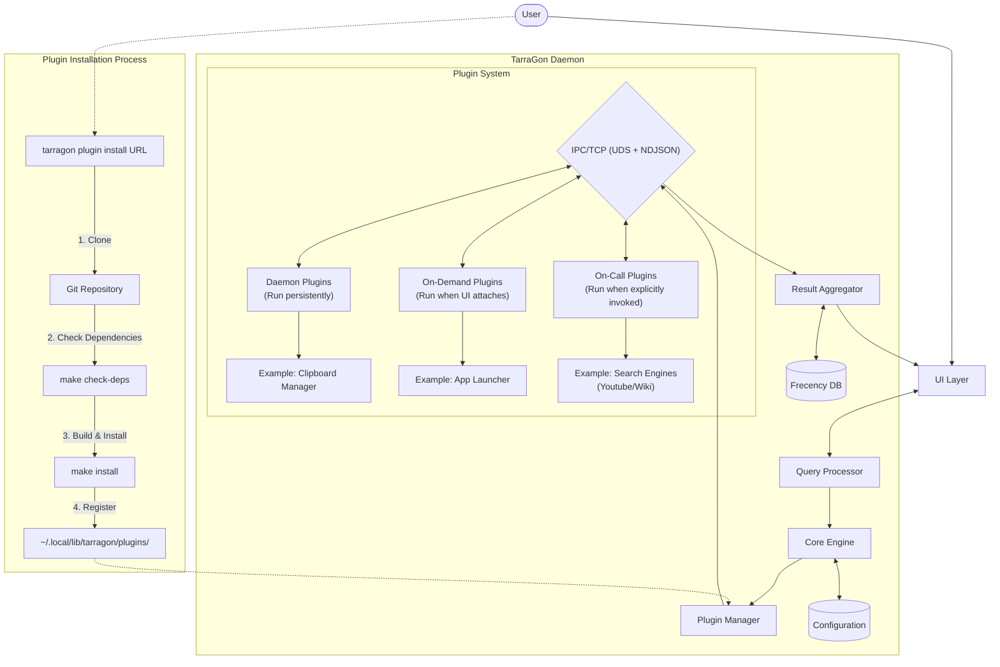

# TarraGon

A highly extensible automation and interaction framework with a language-agnostic plugin system. Built for speed and responsiveness, Tarragon can power anything from command launchers to custom user interfaces. Similar in spirit to macOS Spotlight, Alfred, or dmenu, but designed around a lightweight daemon–plugin architecture that makes it far more extensible and performant.

---

## Core Purpose

- **Primary**: Provide a fast, lightweight core that aggregates and routes requests/responses between plugins and frontends (CLI, TUI, GUI, or custom).
- **Secondary**: Enable easy plugin development in any language through a well-defined IPC protocol (Unix Domain Sockets + NDJSON), supporting rich use-cases like:
  - application launching (roots of the project)
  - calculations and unit conversions
  - web/API integrations
  - clipboard or system utilities
  - custom UI components

Plugins can be invoked directly or contextually, and can expose commands, values, or data streams. Prefixes (e.g., `@search`) are optional hints for targeting specific plugins.

---

## Core Architecture

- **Daemon Mode**: The core launcher logic runs as a persistent background daemon for instant availability.
- **Attachable UI**: A lightweight UI attaches to the daemon on pressing a keyboard shortcut, providing immediate access.

---

## Features

### Application Launcher
- Parses `.desktop` files to find and launch installed applications.
- Fuzzy search with user-configurable scoring.
- Frecency-based sorting (frequency x recency).
- Optional icon display (depending on UI backend).

### Plugin System
- **Integrated Suggestions**: Seamlessly blends suggestions from installed applications and active plugins based on user input.
- **Language Agnostic**: Plugins are external executables or scripts.
- **Persistent Processes & IPC**: For responsiveness, plugins providing real-time suggestions typically run as persistent processes managed by the launcher daemon, communicating via efficient IPC (Unix Domain Sockets + NDJSON) or potentially via TCP (remote/containerized plugins). This avoids per-keystroke lag.
- **Plugin Lifecycle Modes**: Plugins declare their required lifecycle:
    - `daemon`: Runs persistently alongside the launcher daemon (e.g., clipboard manager).
    - `on_demand_persistent`: Started when the UI attaches or first needed; remains active while UI is shown (e.g., calculator, file search).
    - `on_call`: Executed only when explicitly invoked, typically via a prefix (e.g., web search).
- **Fan-Out/Gather for Suggestions**: Input is broadcast to the app searcher and all relevant running plugins concurrently. Results are gathered asynchronously and displayed.
- **Optional Prefixes**: Prefixes (e.g., `@search`) remain available to *force* querying a specific plugin.

### Plugin Installation & Security
- **Location**: Plugins reside in `~/.local/lib/tarragon/plugins/`.
- **Install Sources**:
    - `tarragon plugin install <git-url>` for local plugin directories managed by plugin Makefiles.
    - `tarragon plugin enable <name>` for system binaries exposing `tarragon manifest`.
- **Build Standard**: Plugins requiring compilation must include a `Makefile` providing standardized targets:
    - `make check-deps`: Verifies necessary build tools are present. The launcher can use this to inform the user about requirements.
    - `make install`: Builds the plugin and places artifacts correctly.
- **Entrypoint Resolution**:
    - Relative `entrypoint` values are resolved from the plugin directory.
    - Absolute `entrypoint` values are executed directly (used by system-enabled plugins).
- **User Responsibility**: Users should inspect the `Makefile` of third-party plugins before installation to understand the build process. The launcher may facilitate checking dependencies but relies on the user to vet plugin sources.

---

## Plugin Configuration

See [https://github.com/iMithrellas/tarragon/blob/master/docs/plugins.md](plugins.md).

## Contributing

Contributions are VERY welcome! See [https://github.com/iMithrellas/tarragon/blob/master/CONTRIBUTING.md](CONTRIBUTING.md) for guidelines. Running pre-commit locally helps keep builds green and diffs clean <3.

### Development TODO

Moved to GitHub issue: Roadmap — https://github.com/iMithrellas/tarragon/issues/4

## Shell Completions

Generate completion scripts to a user-writable data dir and source them from your shell config.

- Target directory: `$XDG_DATA_HOME/tarragon/completions` (fallback: `~/.local/share/tarragon/completions`)

```bash
tarragon completion generate bash
tarragon completion generate zsh fish
```

Source in your shell config

- Bash (add to `~/.bashrc`):
```
source "${XDG_DATA_HOME:-$HOME/.local/share}/tarragon/completions/tarragon.bash"
```

- Zsh (add to `~/.zshrc`):
```
source "${XDG_DATA_HOME:-$HOME/.local/share}/tarragon/completions/tarragon.zsh"
```

- Fish (add to `~/.config/fish/config.fish`):
```
source (string join '' $XDG_DATA_HOME '/tarragon/completions/tarragon.fish' ^/dev/null); or source ~/.local/share/tarragon/completions/tarragon.fish
```

- PowerShell (add to `$PROFILE`):
```
if ($env:XDG_DATA_HOME) { . "$env:XDG_DATA_HOME/tarragon/completions/tarragon.ps1" } else { . "$HOME/.local/share/tarragon/completions/tarragon.ps1" }
```


## Flowchart


```mermaid
graph TD
 subgraph Plugins["Plugin System"]
        DaemonPlugins["Daemon Plugins
(Run persistently)"]
        ClipboardMgr["Example: Clipboard Manager"]
        OnDemandPlugins["On-Demand Plugins
(Run when UI attaches)"]
        AppLauncher["Example: App Launcher"]
        OnCallPlugins["On-Call Plugins
(Run when explicitly invoked)"]
        SearchEngines["Example: Search Engines
        (Youtube/Wiki)"]
        Socket{"IPC/TCP (UDS + NDJSON)"}
  end
 subgraph Daemon["TarraGon Daemon"]
        Core["Core Engine"]
        QueryProcessor["Query Processor"]
        PluginManager["Plugin Manager"]
        ResultAggregator["Result Aggregator"]
        Config[("Configuration")]
        FrecencyDB[("Frecency DB")]
        Plugins
  end
 subgraph PluginInstall["Plugin Installation Process"]
        GitRepo["Git Repository"]
        InstallCommand["tarragon plugin install URL"]
        DepCheck["make check-deps"]
        MakeInstall["make install"]
        PluginDir["~/.local/lib/tarragon/plugins/"]
  end
    User(["User"]) --> UI["UI Layer"]
    User -.-> InstallCommand
    UI <--> QueryProcessor
    QueryProcessor --> Core
    Core --> PluginManager
    Core <--> Config
    ResultAggregator <--> FrecencyDB
    PluginManager --> Socket
    Socket <--> DaemonPlugins
    DaemonPlugins --> ClipboardMgr
    Socket <--> OnDemandPlugins
    OnDemandPlugins --> AppLauncher
    OnCallPlugins --> SearchEngines
    Socket <--> OnCallPlugins
    ResultAggregator --> UI
    Socket --> ResultAggregator
    InstallCommand -- "1. Clone" --> GitRepo
    GitRepo -- "2. Check Dependencies" --> DepCheck
    DepCheck -- "3. Build & Install" --> MakeInstall
    MakeInstall -- "4. Register" --> PluginDir
    PluginDir -.-> PluginManager

    classDef anchor shape:anchor
```
