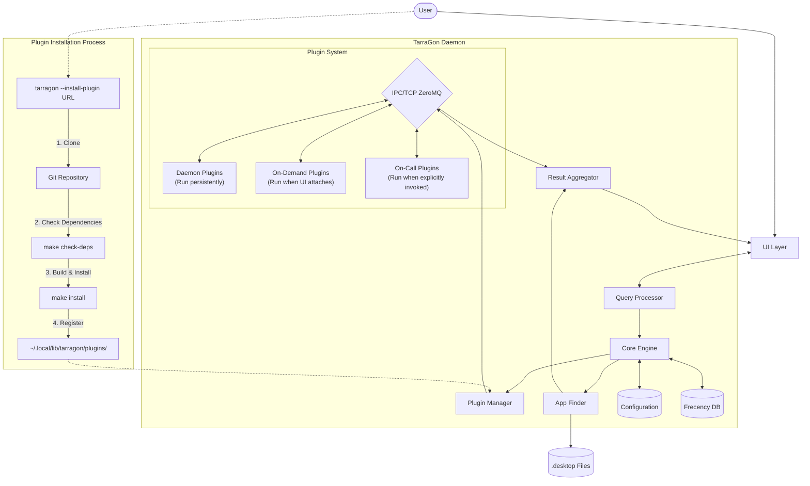

# TarraGon

A highly extensible application launcher designed for speed and responsiveness, featuring a powerful plugin architecture agnostic to the language the plugin was built in with the potential to support custom UIs also.

---

## Core Purpose

- **Primary**: Fast, fuzzy-matching application launcher integrating results from multiple sources (applications, plugins).
- **Secondary**: Extensible via external plugins for calculations, web search, clipboard management, unit conversion, and more. Prefixes (e.g., `@search`) can be used to explicitly target plugins but are not required for general suggestions.

---

## Core Architecture

- **Daemon Mode**: The core launcher logic runs as a persistent background daemon for instant availability.
- **Attachable UI**: A lightweight UI (TUI or GUI) attaches to the daemon on pressing a keyboard shortcut, providing immediate access.

---

## Features

### Application Launcher
- Parses `.desktop` files to find and launch installed applications.
- Fuzzy search with user-configurable scoring.
- Frecency-based sorting (frequency × recency).
- Optional icon display (depending on UI backend).

### Plugin System
- **Integrated Suggestions**: Seamlessly blends suggestions from installed applications and active plugins based on user input.
- **Language Agnostic**: Plugins are external executables or scripts.
- **Persistent Processes & IPC**: For responsiveness, plugins providing real-time suggestions typically run as persistent processes managed by the launcher daemon, communicating via efficient IPC (ZeroMQ) or potentially via TCP(Remote plugins/containerized plugins). This avoids per-keystroke lag.
- **Plugin Lifecycle Modes**: Plugins declare their required lifecycle:
    - `daemon`: Runs persistently alongside the launcher daemon (e.g., clipboard manager).
    - `on_demand_persistent`: Started when the UI attaches or first needed; remains active while UI is shown (e.g., calculator, file search).
    - `on_call`: Executed only when explicitly invoked, typically via a prefix (e.g., web search).
- **Fan-Out/Gather for Suggestions**: Input is broadcast to the app searcher and all relevant running plugins concurrently. Results are gathered asynchronously and displayed.
- **Optional Prefixes**: Prefixes (e.g., `@search`) remain available to *force* querying a specific plugin.

### Plugin Installation & Security
- **Location**: Plugins reside in `~/.local/lib/tarragon/plugins/`.
- **Build Standard**: Plugins requiring compilation must include a `Makefile` providing standardized targets:
    - `make check-deps`: Verifies necessary build tools are present. The launcher can use this to inform the user about requirements.
    - `make install`: Builds the plugin and places artifacts correctly.
- **User Responsibility**: Users should inspect the `Makefile` of third-party plugins before installation to understand the build process. The launcher may facilitate checking dependencies but relies on the user to vet plugin sources.

---

## Plugin Configuration

Each plugin should have a `.toml` configuration file (e.g., `calc.toml`):

```toml
name = "Calculator"
description = "Evaluate basic math expressions"
enabled = true
entrypoint = "calc_plugin_executable"  # Path to the executable/script relative to plugin dir
lifecycle_mode = "on_demand_persistent"  # Options: "daemon", "on_demand_persistent", "on_call"
provides_general_suggestions = true  # Responds to input without a prefix?
prefix = "@calc"  # Optional: Prefix to force this plugin
build_dependencies = ["make", "go"]  # Optional: List of tools checked by 'make check-deps'
capabilities = ["suggest", "icon"]  # Optional: Extra features
icon = "calc.png"  # Optional: Icon path
```

## Development TODO

Moved to GitHub issue: Roadmap — https://github.com/iMithrellas/tarragon/issues/4

## Contributing

Contributions are welcome! Please read CONTRIBUTING.md for setup, Makefile usage, and pre-commit hooks. Running pre-commit locally helps keep builds green and diffs clean.


## Shell Completions

Generate completion scripts to a user-writable data dir and source them from your shell config.

- Target directory: `$XDG_DATA_HOME/tarragon/completions` (fallback: `~/.local/share/tarragon/completions`)

Generate

- All shells (prints per-shell sourcing hints):
```
tarragon completion generate
```

- Specific shells:
```
tarragon completion generate bash
tarragon completion generate zsh fish
```

Source in your shell config

- Bash (add to `~/.bashrc`):
```
source "${XDG_DATA_HOME:-$HOME/.local/share}/tarragon/completions/tarragon.bash"
```

- Zsh (add to `~/.zshrc`):
```
source "${XDG_DATA_HOME:-$HOME/.local/share}/tarragon/completions/tarragon.zsh"
```

- Fish (add to `~/.config/fish/config.fish`):
```
source (string join '' $XDG_DATA_HOME '/tarragon/completions/tarragon.fish' ^/dev/null); or source ~/.local/share/tarragon/completions/tarragon.fish
```

- PowerShell (add to `$PROFILE`):
```
if ($env:XDG_DATA_HOME) { . "$env:XDG_DATA_HOME/tarragon/completions/tarragon.ps1" } else { . "$HOME/.local/share/tarragon/completions/tarragon.ps1" }
```


## Flowchart


```mermaid
graph TD
 subgraph Plugins["Plugin System"]
        DaemonPlugins["Daemon Plugins
(Run persistently)"]
        OnDemandPlugins["On-Demand Plugins
(Run when UI attaches)"]
        OnCallPlugins["On-Call Plugins
(Run when explicitly invoked)"]
        Socket{"IPC/TCP ZeroMQ"}
  end
 subgraph Daemon["TarraGon Daemon"]
        Core["Core Engine"]
        QueryProcessor["Query Processor"]
        PluginManager["Plugin Manager"]
        AppFinder["App Finder"]
        ResultAggregator["Result Aggregator"]
        Config[("Configuration")]
        FrecencyDB[("Frecency DB")]
        Plugins
  end
 subgraph PluginInstall["Plugin Installation Process"]
        GitRepo["Git Repository"]
        InstallCommand["tarragon --install-plugin URL"]
        DepCheck["make check-deps"]
        MakeInstall["make install"]
        PluginDir["~/.local/lib/tarragon/plugins/"]
  end
    User(["User"]) --> UI["UI Layer"]
    User -.-> InstallCommand
    UI <--> QueryProcessor
    QueryProcessor --> Core
    Core --> PluginManager
    Core --> AppFinder
    Core <--> Config
    Core <--> FrecencyDB
    AppFinder --> ResultAggregator
    AppFinder  --> DesktopFiles[(".desktop Files")]
    PluginManager --> Socket
    Socket <--> DaemonPlugins
    Socket <--> OnDemandPlugins
    Socket <--> OnCallPlugins
    ResultAggregator --> UI
    Socket --> ResultAggregator
    InstallCommand -- "1. Clone" --> GitRepo
    GitRepo -- "2. Check Dependencies" --> DepCheck
    DepCheck -- "3. Build & Install" --> MakeInstall
    MakeInstall -- "4. Register" --> PluginDir
    PluginDir -.-> PluginManager

    classDef anchor shape:anchor
```
