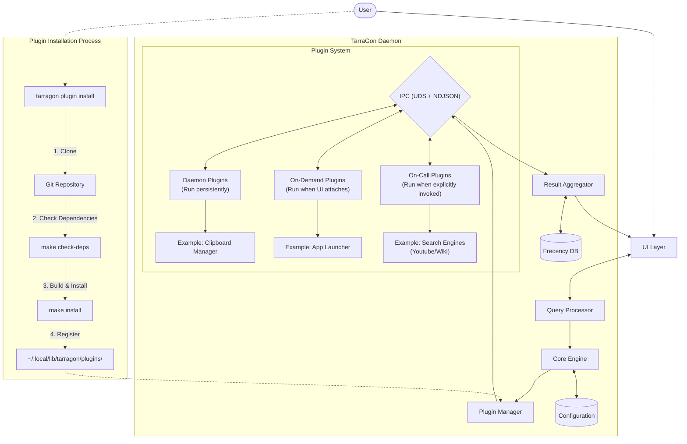

# TarraGon

A highly extensible automation and interaction framework with a language-agnostic plugin system. Built for speed and responsiveness, Tarragon can power anything from command launchers to custom user interfaces. Similar in spirit to macOS Spotlight, Alfred, or dmenu, but designed around a lightweight daemon–plugin architecture that makes it far more extensible and performant.

---

## Core Purpose

- **Primary**: Provide a fast, lightweight core that aggregates and routes requests/responses between plugins and external frontends (CLI, GUI, or custom).
- **Secondary**: Enable easy plugin development in any language through a well-defined IPC protocol (Unix Domain Sockets + NDJSON), supporting rich use-cases like:
  - application launching (one of the original use cases)
  - calculations and unit conversions
  - web/API integrations
  - clipboard or system utilities
  - custom UI components

Plugins can be invoked directly or contextually, and can expose commands, values, or data streams. Prefixes (e.g., `@search`) are optional hints for targeting specific plugins.

---

## Core Architecture

- **Daemon Mode**: The core launcher logic runs as a persistent background daemon for instant availability.
- **Attachable UI**: A lightweight UI attaches to the daemon on pressing a keyboard shortcut, providing immediate access.

---

## Features

### Application Launcher
- Provided by the bundled `desktop_files` plugin, which parses `.desktop` files to find and launch installed applications.
- Fuzzy search with user-configurable scoring.
- Frecency-based sorting (frequency x recency).
- Optional icon display (depending on UI backend).
- Launched applications are detached from the plugin process and remain running across Tarragon daemon restarts.

### Plugin System
- **Integrated Suggestions**: Seamlessly blends suggestions from eligible plugins, including bundled plugins for installed applications and other local tasks.
- **Language Agnostic**: Plugins are external executables or scripts.
- **Persistent Processes & IPC**: For responsiveness, plugins providing real-time suggestions typically run as persistent processes managed by the launcher daemon, communicating via efficient IPC (Unix Domain Sockets + NDJSON). TCP-related config exists as a future-facing placeholder, but the current daemon starts Unix socket IPC only. This avoids per-keystroke lag.
- **Plugin Lifecycle Modes**: Plugins declare their required lifecycle:
    - `daemon`: Runs persistently alongside the launcher daemon (e.g., clipboard manager).
    - `on_demand_persistent`: Started when first needed for a query and kept running afterward.
    - `on_call`: Executed per request (ephemeral process lifecycle).
- **Fan-Out/Gather for Suggestions**: Input is broadcast to eligible plugins concurrently. Results are gathered asynchronously and displayed.
- **Dispatch Controls**: `require_prefix` gates prefix-only plugins, while `provides_general_suggestions` is the general-suggestion eligibility contract for global/unprefixed fan-out.
- **Optional Prefixes**: Prefixes (e.g., `@search`) can still force explicit dispatch to a specific plugin. Plugins declare a bare token and the leading symbol comes from the `prefix_symbol` config option, so it can be changed globally. Any query beginning with that symbol is treated as an explicit routing attempt, so partial or unknown prefixes do not fan out to general plugins.
- **Graceful Shutdown**: Plugins are stopped with `SIGTERM` and only killed if they overrun `plugin_stop_timeout` (default `5s`), so they can flush state and close sockets.
- **Live Restart**: `tarragon plugin restart [plugin-id]` re-reads manifests and bounces plugin processes without restarting the daemon.

### Plugin Benchmarking
- `tarragon bench` connects to the daemon like an external frontend, sends benchmark queries through the UI socket, and prints plugin latency results as a table.
- Run it with `just bench` while the daemon is running.

### Plugin Installation & Security
- **Bundled plugin sources**: First-party bundled plugins live in `plugins/`.
- **Template plugin sources**: Authoring templates live separately in `plugin_templates/` so examples are not installed by bundled-plugin recipes.
- **Location**: Plugins reside in `~/.local/lib/tarragon/plugins/`.
- **Install Sources**:
    - `tarragon plugin install <git-url>` for plugin Git repositories with `plugin.toml` and a Makefile.
    - `tarragon plugin enable <name>` for system binaries exposing `tarragon manifest`.
- **Build Standard**: Plugins requiring compilation must include a `Makefile` providing standardized targets:
    - `make check-deps`: Verifies necessary build tools are present. The launcher can use this to inform the user about requirements.
    - `make install`: Builds the plugin and places artifacts correctly.
- **Entrypoint Resolution**:
    - Relative `entrypoint` values are resolved from the plugin directory.
    - Absolute `entrypoint` values are executed directly (used by system-enabled plugins).
- **User Responsibility**: Users should inspect the `Makefile` of third-party plugins before installation to understand the build process. The launcher may facilitate checking dependencies but relies on the user to vet plugin sources.

---

## Configuration

Tarragon reads its primary config from
`$XDG_CONFIG_HOME/tarragon/tarragon.toml` (normally
`~/.config/tarragon/tarragon.toml`). Use `--config-dir` to select a different
directory.

Optional local or packaged overrides belong in `tarragon.d/*.toml` beside the
primary file:

```text
~/.config/tarragon/
|-- tarragon.toml
`-- tarragon.d/
    |-- 10-host.toml
    `-- 90-local.toml
```

Drop-ins are merged in filename order. Later files override earlier files,
including individual keys in nested plugin sections. Files in `tarragon.d`
that do not end in `.toml` are ignored.

The complete precedence order, from lowest to highest, is:

1. `tarragon.toml`
2. `tarragon.d/*.toml` in lexical filename order
3. Environment variables such as `RESULT_ORDERING` and
   `PLUGINS_CALCULATOR_ENABLED`
4. Explicitly supplied command-line flags

Daemon reload and restart requests re-read the complete stack.

## Plugin Configuration

See [docs/plugins.md](docs/plugins.md).

## Contributing

Contributions are VERY welcome! See [https://github.com/mithrel-dots/TarraGon/blob/master/CONTRIBUTING.md](CONTRIBUTING.md) for guidelines. Running pre-commit locally helps keep builds green and diffs clean <3.

### Development TODO

Moved to GitHub issue: Roadmap — https://github.com/mithrel-dots/TarraGon/issues/4

## Shell Completions

Generate a completion script for one shell to stdout and redirect it to the location used by your shell.

```bash
tarragon completion generate zsh > ~/.zsh/completions/_tarragon
```

Other examples:

```bash
tarragon completion generate bash > ~/.local/share/bash-completion/completions/tarragon
tarragon completion generate fish > ~/.config/fish/completions/tarragon.fish
tarragon completion generate powershell > tarragon.ps1
```


## Flowchart


```mermaid
graph TD
 subgraph Plugins["Plugin System"]
        DaemonPlugins["Daemon Plugins
(Run persistently)"]
        ClipboardMgr["Example: Clipboard Manager"]
        OnDemandPlugins["On-Demand Plugins
(Run when UI attaches)"]
        AppLauncher["Example: App Launcher"]
        OnCallPlugins["On-Call Plugins
(Run when explicitly invoked)"]
        SearchEngines["Example: Search Engines
        (Youtube/Wiki)"]
        Socket{"IPC (UDS + NDJSON)"}
  end
 subgraph Daemon["TarraGon Daemon"]
        Core["Core Engine"]
        QueryProcessor["Query Processor"]
        PluginManager["Plugin Manager"]
        ResultAggregator["Result Aggregator"]
        Config[("Configuration")]
        FrecencyDB[("Frecency DB")]
        Plugins
  end
 subgraph PluginInstall["Plugin Installation Process"]
        GitRepo["Git Repository"]
        InstallCommand["tarragon plugin install <git-url>"]
        DepCheck["make check-deps"]
        MakeInstall["make install"]
        PluginDir["~/.local/lib/tarragon/plugins/"]
  end
    User(["User"]) --> UI["UI Layer"]
    User -.-> InstallCommand
    UI <--> QueryProcessor
    QueryProcessor --> Core
    Core --> PluginManager
    Core <--> Config
    ResultAggregator <--> FrecencyDB
    PluginManager --> Socket
    Socket <--> DaemonPlugins
    DaemonPlugins --> ClipboardMgr
    Socket <--> OnDemandPlugins
    OnDemandPlugins --> AppLauncher
    OnCallPlugins --> SearchEngines
    Socket <--> OnCallPlugins
    ResultAggregator --> UI
    Socket --> ResultAggregator
    InstallCommand -- "1. Clone" --> GitRepo
    GitRepo -- "2. Check Dependencies" --> DepCheck
    DepCheck -- "3. Build & Install" --> MakeInstall
    MakeInstall -- "4. Register" --> PluginDir
    PluginDir -.-> PluginManager

    classDef anchor shape:anchor
```
